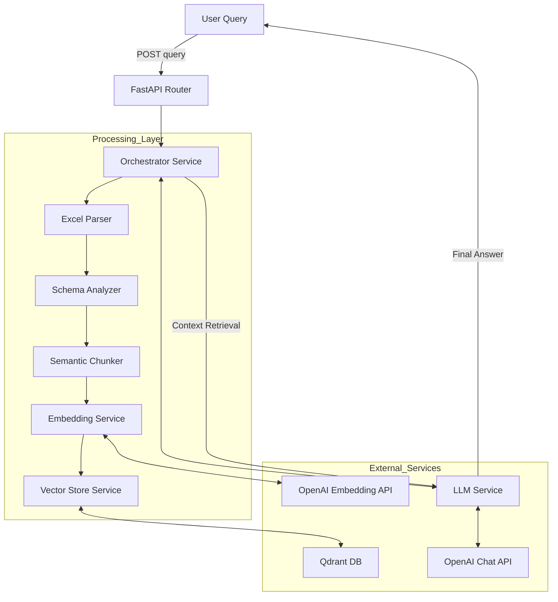
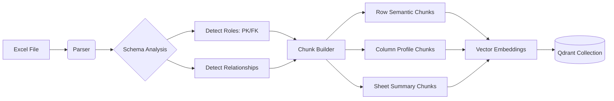

# 📊 Excel RAG Semantic Parser

An intelligent **Excel-to-RAG pipeline** that transforms static spreadsheets into a queryable knowledge base. This project uses Object-Oriented Programming (OOP) principles to parse Excel files, detect cross-sheet relationships, generate semantically enriched chunks, and store them in Qdrant for precise natural language retrieval.

---

## 🚀 Key Features

- ✅ **Semantic Chunking** — Converts raw rows into natural language summaries while preserving column meaning
- 🔗 **Relationship Detection** — Automatically detects Primary Keys (PK), Foreign Keys (FK), and cross-sheet links
- 🧱 **3-Tier Storage Strategy** — Row chunks, Column profiles, and Sheet summaries
- 🧩 **OOP Architecture** — Modular services for parsing, analysis, chunking, and storage
- 🤖 **LLM Answer Synthesis** — Uses GPT models to generate precise answers from retrieved context
- ⚡ **Vector Search** — Powered by Qdrant embeddings

---

## 🏛️ Architecture

### High-Level System Design



### Data Transformation Pipeline



---

## 📁 Project Structure

The project follows a clean separation of concerns:

```text
excel_rag_project/
├── app
│   ├── api/                # API Layer (Routes & Schemas)
│   ├── core/               # Configuration & Settings
│   ├── models/             # Domain Models (Pydantic)
│   ├── services/           # Business Logic (OOP Components)
│   │   ├── analyzer.py     # Logic: Relationships & Roles
│   │   ├── chunker.py      # Logic: Semantic Chunking
│   │   ├── embedder.py     # Logic: OpenAI Integration
│   │   ├── parser.py       # Logic: Excel File Parsing
│   │   └── vector_store.py # Logic: Qdrant Operations
│   └── main.py             # Application Entry Point
├── requirements.txt
└── .env
```

---

## 🛠️ Setup & Installation

### Prerequisites
- Python 3.11+
- Docker (for running Qdrant locally)

### 1. Clone & Install Dependencies

```bash
git clone <your-repo-url>
cd excel_rag_project

python -m venv venv
source venv/bin/activate  # On Windows use `venv\Scripts\activate`
pip install -r requirements.txt
```

### 2. Configure Environment

Create a `.env` file in the root directory:

```ini
# .env
OPENAI_API_KEY=sk-proj-xxxxxxxx

# Local Qdrant
QDRANT_URL=http://localhost:6333
QDRANT_API_KEY=  # Optional for local

LOGLEVEL=INFO
```

### 3. Start Vector Database

```bash
docker run -p 6333:6333 qdrant/qdrant
```

### 4. Run the Server

```bash
uvicorn app.main:app --reload --port 8000
```

---

## 💡 Usage

### API Endpoint

**POST** `/`

Request body:
```json
{
  "excel_file": "https://example.com/path/to/data.xlsx",
  "query": "Give me exceptions for parameter zeroCorrelationZoneConfig",
  "top_k": 10,
  "sheet_filter": null,
  "chunk_type_filter": null
}
```

### Example Response

```json
{
  "answer": "The exception for parameter 'zeroCorrelationZoneConfig' is 'Invalid correlation threshold'...",
  "collection_name": "excel_rag_a1b2c3d4",
  "chunks_indexed": 298,
  "top_matches": [
    {
      "content": "Exception Entry EXC-001 - ZeroCorrZone...",
      "score": 0.89,
      "chunk_type": "row_semantic",
      "sheet_name": "Exceptions"
    }
  ],
  "sheets_parsed": ["Exceptions", "Parameters"],
  "relationships_detected": [
    {
      "type": "shared_key",
      "from": "Exceptions.Parameter",
      "to": "Parameters.Name",
      "overlap": "45%"
    }
  ]
}
```

---

## 🧠 Core Logic Explained

### Semantic Enrichment Strategy

Instead of treating cells as raw text, we enrich them before vectorization:

1.  **Role Detection**: Identifies if a column is a Primary Key (`ID`), Foreign Key (`Link`), or Metadata (`Date`).
2.  **Context Injection**:
    *   *Raw*: `EXC-001`
    *   *Enriched*: `Exception Identifier (identifier): EXC-001`
3.  **Cross-Sheet Context**: If a value links to another sheet, the chunk content explicitly states: `"Links to Parameters sheet"`.

### Chunk Storage Strategy

We store three types of chunks per Excel file to handle different query patterns:

| Chunk Type | Quantity | Purpose |
| :--- | :--- | :--- |
| **Row Semantic** | One per row | Answers specific data queries (e.g., "Find exceptions for X") |
| **Column Profile** | One per column | Answers structural queries (e.g., "What does the Status column contain?") |
| **Sheet Summary** | One per sheet | Answers overview queries (e.g., "What data is in this workbook?") |

---

## 📈 Future Improvements

- [ ] **Hybrid Search**: Implement keyword search (BM25) alongside vector search for better exact-match performance.
- [ ] **Streaming**: Stream LLM responses for faster user feedback.
- [ ] **Caching**: Cache parsed Excel metadata to avoid re-processing unchanged files.
- [ ] **Query Intent Analyzer**: Automatic detection of whether the user wants a specific row, a column summary, or a sheet overview.

## 📄 License

MIT License
```